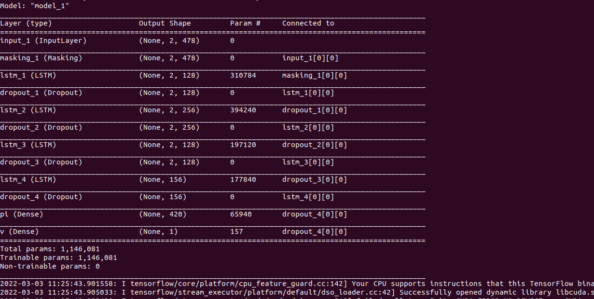
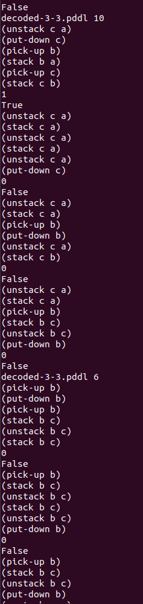
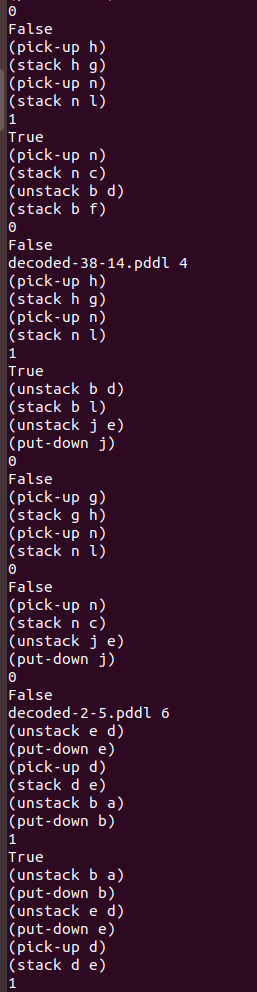
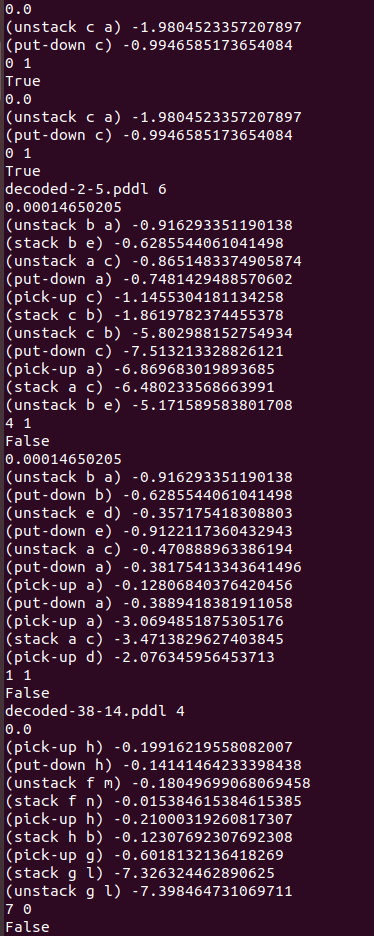
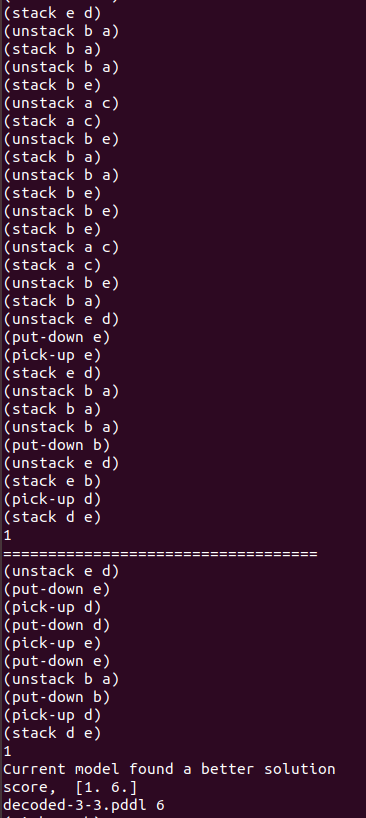

# AlphaZero for Planning

AlphaZero, designed by [DeepMind](https://deepmind.com/blog/article/alphazero-shedding-new-light-grand-games-chess-shogi-and-go), is a single system that taught itself from scratch how to master the games of chess, shogi, and Go, beating a world-champion in each case. It uses deep-learning model to learn policy and value models without using human generated training samples. This repository contains a source code of a model that solves planning problems using similar techniques as AlphaZero. Planning is composing sequences of actions that, when executed starting from an initial state of the environment, will lead to the satisfaction of a given goal. Similar to AlphaZero, our implementation alternates between neural network evaluation and Monte Carlo Tree search policy improvement for a stable learning. Unlike games which have a fixed set of goal states, the goal in planning varies with the planning problem. Therefore, the goal state should be included in the neural network input representation. We have also experimented with different reward functions. 

We used [pyperplan](https://github.com/aibasel/pyperplan), a STRIPS planner written in python, for parcing problem and domain files and heuristic functions used to calculate rewards. 

# How to Run

1. Clone the repository to your local machine  
`git clone https://gricad-gitlab.univ-grenoble-alpes.fr/wallelis/alphazero-for-planning.git`
2. Go to the main directory
`cd alphazero-for-planning`
3. Install dependencies. Using [python virtual environment](https://towardsdatascience.com/virtual-environments-104c62d48c54) is recommended to avoid version clashes.  
`pip3 install -r requirements.txt`
4.  Go to the version that you want to execute  
`cd MuZero`  for MuZero  
`cd AlphaZero` for AlphaZero

5. Put the training problems in test_problems and create a dataset.csv file with filenames of the training problems and their estimated cost (initial heuristic value) as shown in the `dataset.csv` file. Instead of using a heuristic function to determine the cost, we can also use any arbitrary high value (100 or 200) as an intial cost and every time a smaller cost is found during MCTS simulations, the dataset will be updated with the new cost.  
6. Run the main function as  
`python3 main.py <PATH TO DOMAIN FILE> <PATH TO THE LARGEST PROBLEM FILE>`   
Since the neural network has a fixed number of inputs, we use 'The largest problem' to set the maximum possible input and output nodes.  
The largest problem is a problem with the maximum number of objects both from the training and test dataset.  

For example taking Blocksworld domain, if the largest problem in the training and test dataset contains 14 blocks

`(alphazero) sera@sera-work:~/alphazero-for-planning/AlphaZero$ python3 main.py domain.pddl test_prob/decoded-38-14.pddl`  

Where domain.pddl is the Blocksworld domain file and decoded-38-14.pddl is the largest problem.  
The above code starts training which alternates between data generation using self-play and neural network training.  

The program first displays the summary of the network output as shown in the figure below. The network has layers of LSTM followed by Dropout layer to control overfitting and two output layers; Policy putput(pi)- containing nodes equal to the number of possible actions and value output (v)- a single node which predicts the probability of reaching a goal within a given distance or the heuristic value of the last state.

 

At the beginning of the training (image on the left), the output from the self-play is random and most of the simulations do not reach a goal. The images below show the output from self-play for Blocksworld domain. The outputs from AlphaZero show the selected actions and whether goal is reached(True, reward=1) or not(False, reward=0). The output from MuZero (right image) shows the predicted value of the initial state (0/close to zero for the first iteration), the values from the MCTS for each state selected, the heuristic value of the final state reached, and goal reached/not. As the the training progresses and NN weights are updated, the self-play starts to generate more "quality" data (image in the middle after 11th iteration and two network updates) 
 |  |  
*AlphaZero Self-play output first iteration &nbsp; &nbsp; &nbsp; &nbsp; &nbsp; &nbsp; &nbsp; &nbsp; AlphaZero Self-play output 11th iteration &nbsp; &nbsp; &nbsp; &nbsp; &nbsp; &nbsp; &nbsp; MuZero Self-play output first iteration*

After enough data is generated (user selected parameter), the NN is trained with the data generated from the self-play. To avoid overfitting, the best model so far and the current trained NN will each try to solve n (11 in this example) test problems. The best model is updated if the current model solves more problems. In our example for Blocksworld, after the third iteration, the current model found a plan for 6 more problems than the best model. The old best model is replaced by the current trained model and will be used during self-play to generate better data.  

  

The self-play followed by NN training is repeated until stopping criteria (iteration number) is reached. Refer to [AlphaZero for Planning](AlphaZero_for_planning.pdf) for more.

